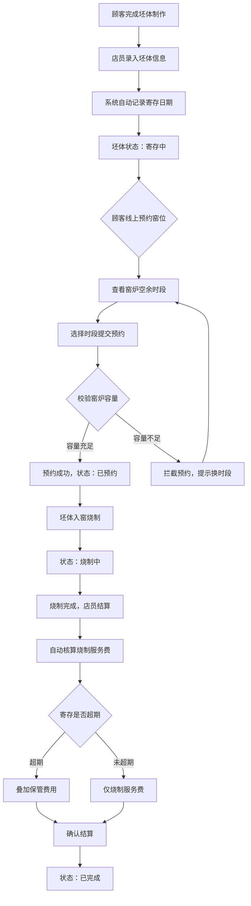

## 1. 产品概述

手工陶艺店坯体寄存与烧制预约管理系统，为陶艺门店提供从坯体寄存登记、窑位预约到烧制结算的完整业务闭环。解决手工陶艺店在坯体寄存管理混乱、窑位预约冲突、烧制费用手工核算易错等痛点，目标用户为陶艺门店店员与顾客。

## 2. 核心功能

### 2.1 用户角色

| 角色 | 注册方式 | 核心权限 |
|------|----------|----------|
| 店员 | 系统预设账号 | 坯体登记、窑位管理、烧制结算、查看待烧制清单 |
| 顾客 | 无需注册 | 线上预约窑位、查看寄存坯体状态、费用估算 |

### 2.2 功能模块

1. **坯体登记页面**: 坯体信息录入、寄存登记、寄存记录查询
2. **窑位预约页面**: 窑炉时段展示、预约提交、容量校验
3. **烧制结算页面**: 费用自动核算、寄存超期加收、结算确认
4. **后台管理页面**: 待烧制清单、寄存到期提醒、坯体状态追踪
5. **费用估算页面**: 模拟不同尺寸与寄存时长的费用计算

### 2.3 页面详情

| 页面名称 | 模块名称 | 功能描述 |
|----------|----------|----------|
| 坯体登记 | 信息录入表单 | 录入坯体编号（自动生成）、尺寸（小/中/大）、釉料类型（素坯/透明釉/彩釉/结晶釉），系统自动记录寄存起始日期 |
| 坯体登记 | 寄存记录列表 | 展示所有寄存坯体，支持按状态筛选（寄存中/已预约/烧制中/已完成），显示寄存天数与到期提醒 |
| 窑位预约 | 窑炉时段日历 | 按日期展示窑炉各时段（上午/下午/晚间）的空余容量，已满时段置灰不可选 |
| 窑位预约 | 预约提交 | 选择坯体与时段后提交预约，后端校验时段剩余容量，容量不足拦截并提示 |
| 烧制结算 | 费用核算明细 | 根据坯体尺寸×釉料品类自动计算烧制服务费，寄存超期天数×日保管费叠加保管费 |
| 烧制结算 | 结算确认 | 展示费用明细，确认后标记坯体为已完成，生成结算单 |
| 后台管理 | 待烧制清单 | 批量查看所有待烧制坯体，支持按日期、尺寸、釉料筛选排序 |
| 后台管理 | 寄存到期提醒 | 临近寄存到期（3天内）的坯体主动高亮提醒，超期坯体标红警示 |
| 费用估算 | 费用模拟器 | 选择坯体尺寸、釉料类型、寄存天数，实时计算预估总费用 |

## 3. 核心流程

顾客完成陶艺坯体制作后，店员在系统中录入坯体信息完成寄存登记，系统自动记录寄存起始日期并生成坯体编号。顾客线上查看窑炉空余时段，选择合适时段提交预约，系统校验该时段窑炉剩余容量，容量充足则预约成功，不足则拦截提示。烧制完成后，店员进行结算操作，系统根据坯体尺寸和釉料类型自动核算烧制服务费，若寄存超期则叠加保管费用，确认结算后坯体标记为已完成。后台可批量查看待烧制清单，临近寄存到期的坯体主动推送提醒。

## 4. 用户界面设计

### 4.1 设计风格

- 主色调：陶土暖棕 (#8B6F47) 搭配窑火橘红 (#C85A36)
- 辅助色：素坯米白 (#F5F0E8)、釉面青灰 (#6B7B8D)
- 按钮风格：圆角微凸，带微妙阴影的质感按钮
- 字体：正文使用 Noto Serif SC 衬线体营造手工艺氛围，数据/操作使用 Source Han Sans
- 布局风格：左侧导航栏 + 右侧内容区，卡片式内容组织
- 图标风格：线描陶艺工具风格图标

### 4.2 页面设计概览

| 页面名称 | 模块名称 | UI元素 |
|----------|----------|--------|
| 坯体登记 | 信息录入表单 | 居中卡片式表单，坯体编号自动填充，尺寸三选一按钮组，釉料类型下拉选择，提交按钮带加载状态 |
| 坯体登记 | 寄存记录列表 | 表格式展示，状态标签彩色编码（寄存中-蓝/已预约-橙/烧制中-红/已完成-绿），临近到期行背景渐变警示 |
| 窑位预约 | 窑炉时段日历 | 周视图日历格，每个时段显示容量进度条，空余可点选，已满置灰，选中态窑火色高亮 |
| 窑位预约 | 预约提交 | 右侧滑出确认面板，展示选中坯体与时段信息，容量校验结果即时反馈 |
| 烧制结算 | 费用核算明细 | 分项明细卡片，烧制费+保管费分列展示，超期部分用橘红标注，底部合计大字展示 |
| 烧制结算 | 结算确认 | 确认弹窗带费用汇总，确认按钮双击防误触 |
| 后台管理 | 待烧制清单 | 可排序表格，支持多条件筛选，批量操作工具栏 |
| 后台管理 | 寄存到期提醒 | 顶部横幅提醒条+侧边浮动提醒图标，点击展开到期列表 |
| 费用估算 | 费用模拟器 | 三步式选择器（尺寸→釉料→天数），右侧实时费用预览卡片，滑块调节寄存天数 |

### 4.3 响应式设计

- 桌面端优先设计，最小宽度 1280px
- 平板端（768px-1280px）侧边栏折叠为图标模式
- 移动端（< 768px）底部Tab导航，内容区单列布局

### 4.4 3D场景指引

不适用
