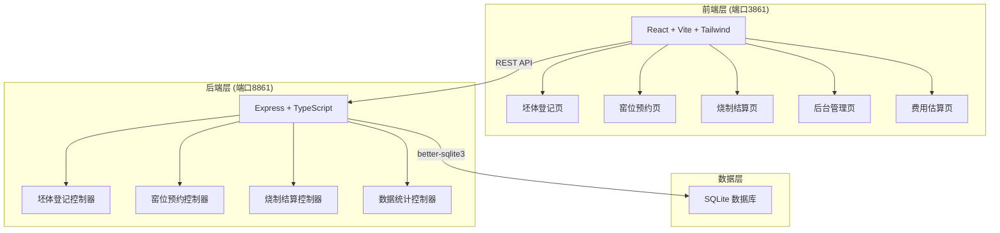
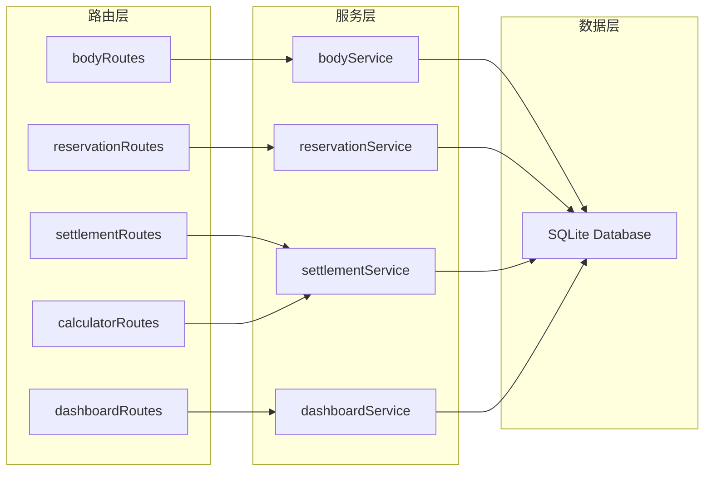
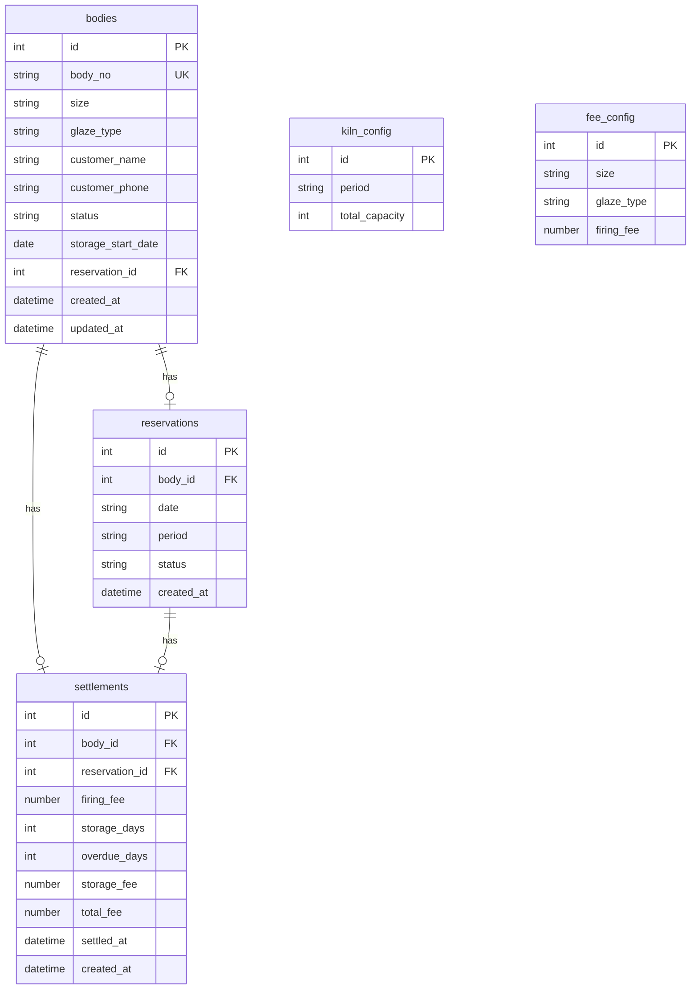

## 1. 架构设计



## 2. 技术说明

- 前端：React@18 + TailwindCSS@3 + Vite + Zustand
- 初始化工具：vite-init
- 后端：Express@4 + TypeScript (ESM)
- 数据库：SQLite (better-sqlite3)，单文件数据库，无需外部服务
- 端口：后端 API 运行在 8861，前端开发服务器运行在 3861

## 3. 路由定义

| 路由 | 用途 |
|------|------|
| / | 首页仪表盘，概览统计数据 |
| /register | 坯体登记页面，录入寄存信息 |
| /reservation | 窑位预约页面，查看时段与预约 |
| /settlement | 烧制结算页面，费用核算与确认 |
| /management | 后台管理页面，待烧制清单与提醒 |
| /calculator | 费用估算页面，模拟费用计算 |

## 4. API 定义

### 4.1 坯体登记

```
POST   /api/bodies                 创建坯体寄存记录
GET    /api/bodies                 获取坯体列表（支持状态筛选）
GET    /api/bodies/:id             获取单个坯体详情
PUT    /api/bodies/:id/status      更新坯体状态
```

**创建坯体请求体：**
```typescript
interface CreateBodyRequest {
  bodyNo: string
  size: "small" | "medium" | "large"
  glazeType: "bisque" | "transparent" | "colored" | "crystal"
  customerName: string
  customerPhone: string
}
```

**坯体响应体：**
```typescript
interface BodyRecord {
  id: number
  bodyNo: string
  size: "small" | "medium" | "large"
  glazeType: "bisque" | "transparent" | "colored" | "crystal"
  customerName: string
  customerPhone: string
  status: "stored" | "reserved" | "firing" | "completed"
  storageStartDate: string
  reservationId?: number
  createdAt: string
  updatedAt: string
}
```

### 4.2 窑位预约

```
GET    /api/kiln/slots             获取窑炉时段列表（按日期）
POST   /api/reservations           创建预约
GET    /api/reservations           获取预约列表
DELETE /api/reservations/:id       取消预约
```

**窑炉时段响应体：**
```typescript
interface KilnSlot {
  date: string
  period: "morning" | "afternoon" | "evening"
  totalCapacity: number
  usedCapacity: number
  availableCapacity: number
}
```

**创建预约请求体：**
```typescript
interface CreateReservationRequest {
  bodyId: number
  date: string
  period: "morning" | "afternoon" | "evening"
}
```

**预约响应体：**
```typescript
interface Reservation {
  id: number
  bodyId: number
  bodyNo: string
  date: string
  period: "morning" | "afternoon" | "evening"
  status: "pending" | "firing" | "completed" | "cancelled"
  createdAt: string
}
```

### 4.3 烧制结算

```
POST   /api/settlements/calculate  计算烧制费用（不保存）
POST   /api/settlements            确认结算
GET    /api/settlements            获取结算记录列表
GET    /api/settlements/:id        获取结算详情
```

**费用计算请求体：**
```typescript
interface CalculateFeeRequest {
  bodyId: number
}
```

**费用计算响应体：**
```typescript
interface FeeCalculation {
  bodyId: number
  bodyNo: string
  size: string
  glazeType: string
  firingFee: number
  storageDays: number
  freeStorageDays: number
  overdueDays: number
  storageFee: number
  totalFee: number
}
```

**结算确认请求体：**
```typescript
interface ConfirmSettlementRequest {
  bodyId: number
}
```

### 4.4 后台管理

```
GET    /api/dashboard/stats        获取仪表盘统计数据
GET    /api/dashboard/expiring     获取即将到期坯体列表
GET    /api/dashboard/pending      获取待烧制坯体清单
```

**统计数据响应体：**
```typescript
interface DashboardStats {
  totalBodies: number
  storedCount: number
  reservedCount: number
  firingCount: number
  completedCount: number
  expiringCount: number
  overdueCount: number
}
```

### 4.5 费用估算

```
POST   /api/calculator/estimate    模拟费用计算
```

**模拟费用请求体：**
```typescript
interface EstimateRequest {
  size: "small" | "medium" | "large"
  glazeType: "bisque" | "transparent" | "colored" | "crystal"
  storageDays: number
}
```

## 5. 服务端架构图



## 6. 数据模型

### 6.1 数据模型定义



### 6.2 数据定义语言

```sql
CREATE TABLE IF NOT EXISTS fee_config (
    id INTEGER PRIMARY KEY AUTOINCREMENT,
    size TEXT NOT NULL,
    glaze_type TEXT NOT NULL,
    firing_fee REAL NOT NULL,
    UNIQUE(size, glaze_type)
);

CREATE TABLE IF NOT EXISTS kiln_config (
    id INTEGER PRIMARY KEY AUTOINCREMENT,
    period TEXT NOT NULL UNIQUE,
    total_capacity INTEGER NOT NULL DEFAULT 10
);

CREATE TABLE IF NOT EXISTS bodies (
    id INTEGER PRIMARY KEY AUTOINCREMENT,
    body_no TEXT NOT NULL UNIQUE,
    size TEXT NOT NULL CHECK(size IN ('small', 'medium', 'large')),
    glaze_type TEXT NOT NULL CHECK(glaze_type IN ('bisque', 'transparent', 'colored', 'crystal')),
    customer_name TEXT NOT NULL,
    customer_phone TEXT NOT NULL,
    status TEXT NOT NULL DEFAULT 'stored' CHECK(status IN ('stored', 'reserved', 'firing', 'completed')),
    storage_start_date TEXT NOT NULL,
    reservation_id INTEGER,
    created_at TEXT NOT NULL DEFAULT (datetime('now')),
    updated_at TEXT NOT NULL DEFAULT (datetime('now'))
);

CREATE TABLE IF NOT EXISTS reservations (
    id INTEGER PRIMARY KEY AUTOINCREMENT,
    body_id INTEGER NOT NULL,
    date TEXT NOT NULL,
    period TEXT NOT NULL CHECK(period IN ('morning', 'afternoon', 'evening')),
    status TEXT NOT NULL DEFAULT 'pending' CHECK(status IN ('pending', 'firing', 'completed', 'cancelled')),
    created_at TEXT NOT NULL DEFAULT (datetime('now')),
    FOREIGN KEY (body_id) REFERENCES bodies(id)
);

CREATE TABLE IF NOT EXISTS settlements (
    id INTEGER PRIMARY KEY AUTOINCREMENT,
    body_id INTEGER NOT NULL,
    reservation_id INTEGER,
    firing_fee REAL NOT NULL,
    storage_days INTEGER NOT NULL,
    overdue_days INTEGER NOT NULL DEFAULT 0,
    storage_fee REAL NOT NULL DEFAULT 0,
    total_fee REAL NOT NULL,
    settled_at TEXT NOT NULL DEFAULT (datetime('now')),
    created_at TEXT NOT NULL DEFAULT (datetime('now')),
    FOREIGN KEY (body_id) REFERENCES bodies(id),
    FOREIGN KEY (reservation_id) REFERENCES reservations(id)
);

INSERT INTO fee_config (size, glaze_type, firing_fee) VALUES
    ('small', 'bisque', 30),
    ('small', 'transparent', 40),
    ('small', 'colored', 50),
    ('small', 'crystal', 60),
    ('medium', 'bisque', 50),
    ('medium', 'transparent', 65),
    ('medium', 'colored', 80),
    ('medium', 'crystal', 95),
    ('large', 'bisque', 80),
    ('large', 'transparent', 100),
    ('large', 'colored', 120),
    ('large', 'crystal', 150);

INSERT INTO kiln_config (period, total_capacity) VALUES
    ('morning', 10),
    ('afternoon', 10),
    ('evening', 8);
```
